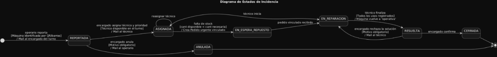
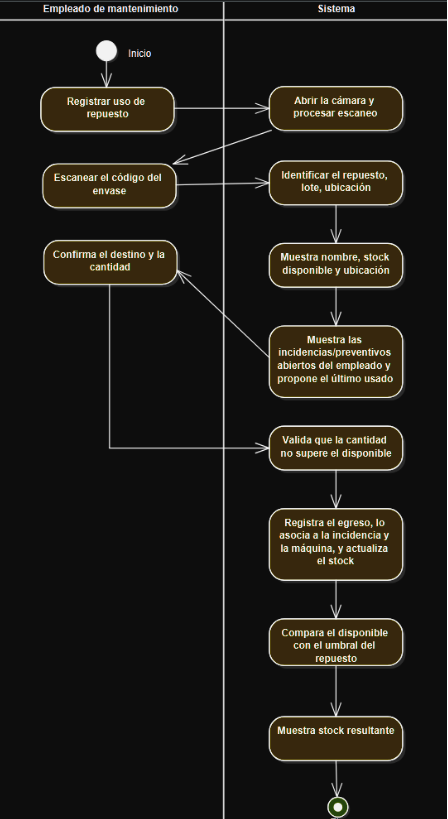
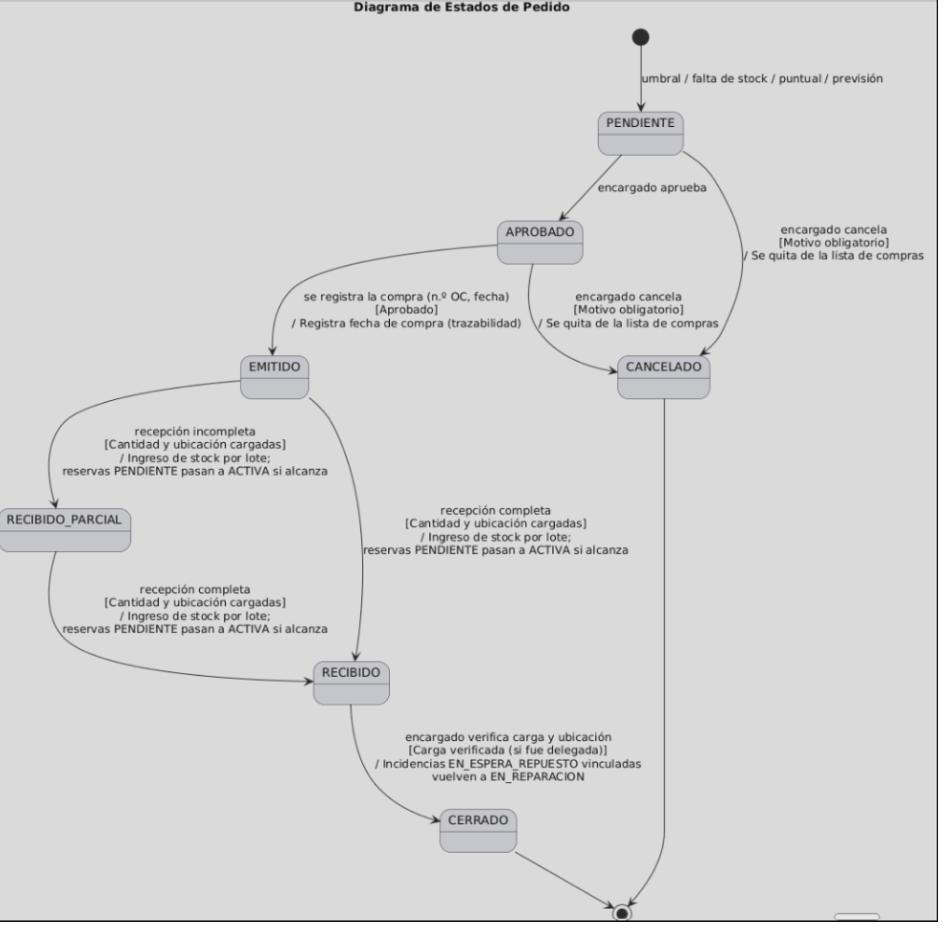
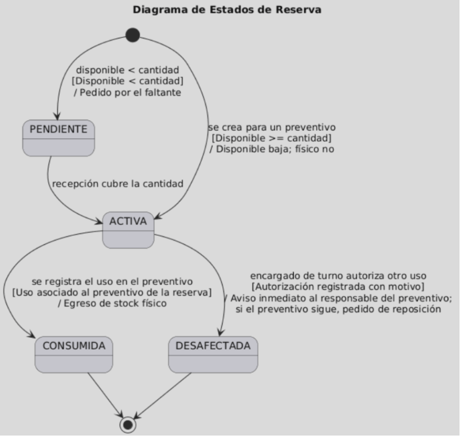

# M1 — Especificación del caso de uso principal

**Sistema de Gestión de Stock y Mantenimiento de Planta · Desarrollo de Software 2026 · Comisión S32**

---

## CU-01 — Registrar uso de repuesto por escaneo

### Identificación

| Campo | Valor |
|---|---|
| **Actor principal** | Empleado de mantenimiento |
| **Actores secundarios** | Encargado de turno · Servidor de correo |
| **Objetivo** | Descontar del stock el repuesto usado y dejar registrado en qué máquina o reparación se usó. |

### Precondiciones

- El empleado está **autenticado** en el celular.
- El repuesto está **dado de alta** y su envase tiene **código legible**.
- Existe una incidencia **EN_REPARACIÓN** asignada al empleado, o un **preventivo en curso**.

### Postcondiciones

- **Éxito:** se registró un **movimiento de egreso** asociado a la incidencia/preventivo y a la máquina; el **stock quedó actualizado**; si el disponible llegó al mínimo, se generó la **alerta** y el ítem en la **lista de compras**.
- **Fracaso:** el stock **no cambia** y **no queda ningún movimiento** registrado.

### Escenario principal

1. El empleado elige **"Registrar uso"**.
2. El sistema abre la **cámara** para escanear.
3. El empleado escanea el **código del envase**.
4. El sistema identifica el **repuesto** y el **lote**, y muestra nombre, stock disponible y ubicación.
5. El sistema muestra las **incidencias/preventivos abiertos** del empleado y propone el último usado.
6. El empleado confirma el **destino** y la **cantidad** (por defecto `1`).
7. El sistema valida que la cantidad **no supere el disponible** (RN-02, RN-03).
8. El sistema **registra el egreso**, lo asocia a la incidencia y la máquina, y **actualiza el stock** (RN-01, RN-08).
9. El sistema compara el **disponible** con el **umbral mínimo** del repuesto (RN-04).
10. El sistema muestra la **confirmación** con el stock resultante.

### Escenarios alternativos

| # | Condición | Curso alternativo |
|---|---|---|
| **3a** | El código no se puede leer | El empleado busca por **nombre, descripción o código manual**. → Vuelve al paso **4**. |
| **5a** | El uso corresponde a un preventivo **con reserva** | El sistema **consume la reserva** (`Reserva → LIBERADA`) en lugar del disponible. → Vuelve al paso **8**. |
| **7a** | El disponible no alcanza, pero hay unidades **reservadas** | El sistema ofrece **pedir desafectación**; el encargado de turno autoriza (`Reserva → DESAFECTADA`) y se notifica al responsable del preventivo (RN-06). → Vuelve al paso **8**. |
| **7b** | Disponible = `0` y **sin reservas** | El sistema ofrece **reportar falta de stock** (RN-03); la incidencia pasa a **EN_ESPERA_REPUESTO**. → **Fin del CU**. |
| **9a** | El disponible quedó **≤ mínimo** y no hay pedido abierto | El sistema crea el pedido en **PENDIENTE**, lo suma a la **lista de compras** y envía el **mail de alerta** (RN-09). → Vuelve al paso **10**. |
| **9b** | Ya hay un **pedido abierto** de ese repuesto | **No se duplica**. → Vuelve al paso **10**. |

---

## Reglas de negocio

- **RN-01 — Descuento por uso.** Usar un repuesto en una reparación descuenta **stock físico** la `cantidad` de línea de uso (entera ≥ 1). El stock físico resultante debe ser **≥ 0**: si no alcanza, el uso se rechaza.
- **RN-02 — Umbral.** Cada repuesto tiene un `umbral mínimo`. Cuando `stock disponible ≤ umbral mínimo`, se genera una **alerta** y el repuesto aparece en la **lista de compras**.
- **RN-03 — Faltante → compra.** Si no hay **stock disponible** para una solicitud, el empleado lo reporta y puede **generar un pedido de compra**.
- **RN-04 — Urgencia.** El pedido de compra se envía con su **grado de urgencia** a los **encargados de todos los turnos** y a la **gerencia**.
- **RN-05 — Reserva.** Un repuesto **reservado** no se usa en otra incidencia. La liberación exige **autorización de un usuario con rol Encargado** y **aviso inmediato** del cambio y su impacto sobre lo planificado.
- **RN-06 — Trazabilidad.** De cada repuesto se reconstruye su historia **interna**: pedido de compra → recepción (RN-08) → uso. *La logística externa con proveedores queda fuera del alcance* (sección 7).
- **RN-07 — Nueva maquinaria.** Al ingresar una nueva máquina, se **registra** y se genera la **lista de repuestos** a mantener en stock.
- **RN-08 — Carga de compra.** Al recibir una compra, se **carga el stock físico y su ubicación**; la tarea puede **delegarse** y **supervisarse**.
- **RN-09 — Notificación por correo.** Se notifican por correo: **incidentes, cambios de parte, solicitudes de compra, informes de resolución y alertas de umbral**. *(Implementación vía puerto de notificación con adaptador falso por defecto, sección 7.)*
- **RN-10 — Consumo de reserva.** Al **ejecutar** el mantenimiento preventivo, se **descuenta el stock físico y se libera la reserva** en la **misma transacción**.

----

## Diagramas de Estado y Actividades

## Diagramas de Estado y Actividades

### 1. Máquina de Estados: Incidencia

### 2. Diagrama de Actividades: CU Principal

### 3. Máquina de Estados: Pedido

### 4. Máquina de Estados: Reserva
